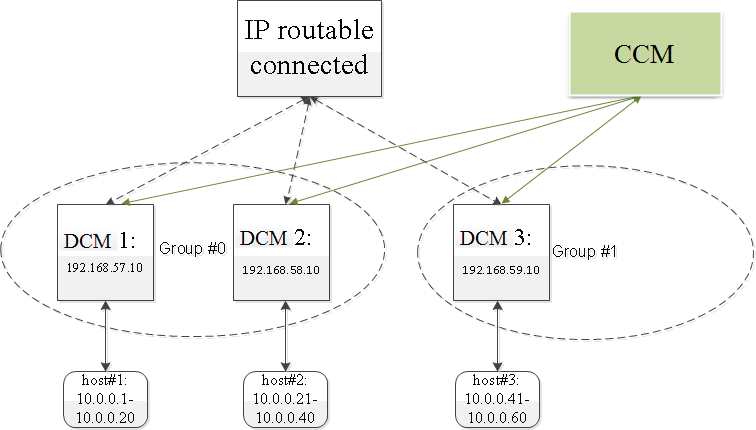

The LazyCtrl project
=================================
*Self-adaptive performance-tunning control architecture for SDN networks*

* Version: 0.21
* Authors: [Baohua Yang](mailto:baohyang@cn.ibm.com), [Kai Zheng](mailto:zhengkai@cn.ibm.com)
* Homepage: <https://github.com/yeasy/lazyctrl>

##Get Code
```
git clone git@github.com:yeasy/lazyctrl.git
```  
or  
```
git clone https://github.com/yeasy/lazyctrl.git
```

## Code Organization

### CCM
CCM directory includes the related code of a CCM module. CCM designs the SDN controller platform (floodlight-lc) based on the [floodlight](http://www.projectfloodlight.org/floodlight) project. floodlight-lc supports an enhanced version of [OpenFlow 1.0](http://archive.openflow.org/documents/openflow-spec-v1.0.0.pdf) protocol (We add code to support packetRemote action, which will encapsulate packet and send to remote end.). Besides, our app runs over floodlight-lc to handle cross-group traffic request. 

Some daemons are responsible to maintain the grouping in the networks, and also keep the communication between CCM and DCMs. The grouping generation is based on [METIS](http://glaros.dtc.umn.edu/gkhome/metis/metis/overview) project, and the gpmetis binary is suggested be compiled on your own platform.

### DCM
DCM includes two parts: openvswitch-lc and agent daemon. The openvswitch-lc is designed based on the [OpenvSwitch](http://openvswitch.org) project. First, openvswitch-lc also supports the packetRemote action from the controller. Besides, the ovsd module in openvswitch-lc will collect and maintain an table for the belonging group through multicast message exchange, while the datapath kernel module are also modified to provides corresponding forwarding functions. 

Specific agent daemon is run at every DCM to report its state (e.g., cpu utilization). Also, some DCM is designated as a DDCM for every group.

###Others
A test platform to check the functions of grouping algorithm, large-scale performance, etc.

##Installation

###Basic Requirements:

* Support  [OpenvSwitch](http://openvswitch.org).
* Support [Floodlight Controller](http://www.projectfloodlight.org/floodlight).
* Support [METIS](http://glaros.dtc.umn.edu/gkhome/metis/metis/overview).
* Physical switches that support IP multi-cast.
* Server (as controller) can login into the servers (as edge switches, with at least 2 separate network interfaces) running OpenvSwtich via ssh without authorization (Need to put the public authorization key previously).

####Sample Testbed:


* Three edge switch instances (belonging to two groups) are connected through a physical switch (IP communicable), and are connected to the CCM.
* Deploy the DCM code at every edge switches (DCM 1 - DCM 3), following the installation documents inside. Modify the address information as necessary. For example, the default control layer IP of DCM 1 is ```192.168.57.10```, while for DCM 2, the IP is ```192.168.57.11```. Start the agent daemon.
* Start floodlight-lc  in CCM to receive PACKET_IN msg, start the group manager daemons to collect upward statistics.

## How does it work?
Basically, the floodlight-lc+openvswitch-lc cooperate as the basic control-datapath model in SDN. Based on them, we enhanced openvswitch-lc+agent to behave as DCM/DDCM, while floodlight-lc+daemons work as the CCM. More details are discussed in the paper, e.g., the group maintain algorithm and the implementation technical issues.


##Documentation
Besides the readme files, you can easily make the API document with python/java/c doc tools. Plenty comments in the code would also be helpful.

##Support
Feel free to email to the authors. The project is planed to be community-supported soon.


##Contributing
There are still numbers of components available to optimize. For example, to build more robust message switching system. 

Everyone is encouraged to download the code, examine it, modify it, and submit bug reports, bug fixes, feature requests, new features and other issues and pull requests. Thanks to everyone who has contributed to the project.
